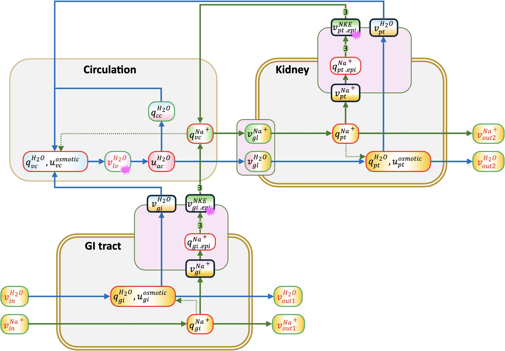

Blood volume control model
==========================

A simple model of the control of blood volume by sodium. Shown below, the three compartments (GI tract, kidney, and circulation system) are shown with grey backgrounds. The blue-background rectangular boxes indicate the 6-layer FTUs (Functional Tissue Units) that encompass exchange of substances (in this case just water and sodium) between the epithelial compartments and blood. The 0:nodes and 1:nodes provide the link to protein mechanisms in subcellular compartments. The variables shown in red are specified boundary conditions.

   The figure depicts the components of the renal circulation system.

