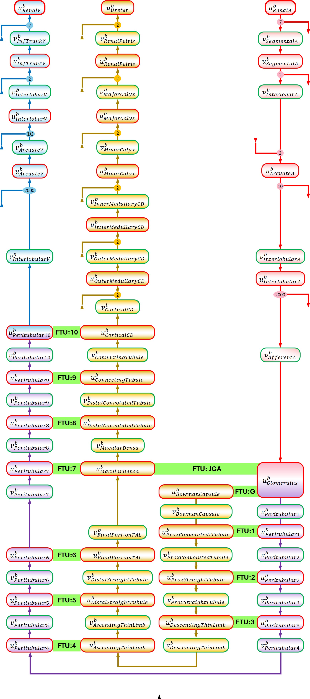

CVS model
======================================================================================

This is a model of whole-body circulation, showing the flow of blood throughout the major organs: heart, lung, renal, gut, brain, limbs. The bond-graph model is illustrated in the figure below, with the CellML model added for simulation purposes.

   The figure depicts the components of the renal circulation system.

After clicking the CellML file, the **Views Available** menu to the right provides various options to explore this model here in the Physiome Model Repository.
Of particular interest is the *Launch with OpenCOR* menu item, which will load the simulation experiment shown below directly into the `OpenCOR`_ desktop application.

.. _CellML: https://www.cellml.org/
.. _OpenCOR: https://opencor.ws/
.. _SED-ML: https://sed-ml.org

