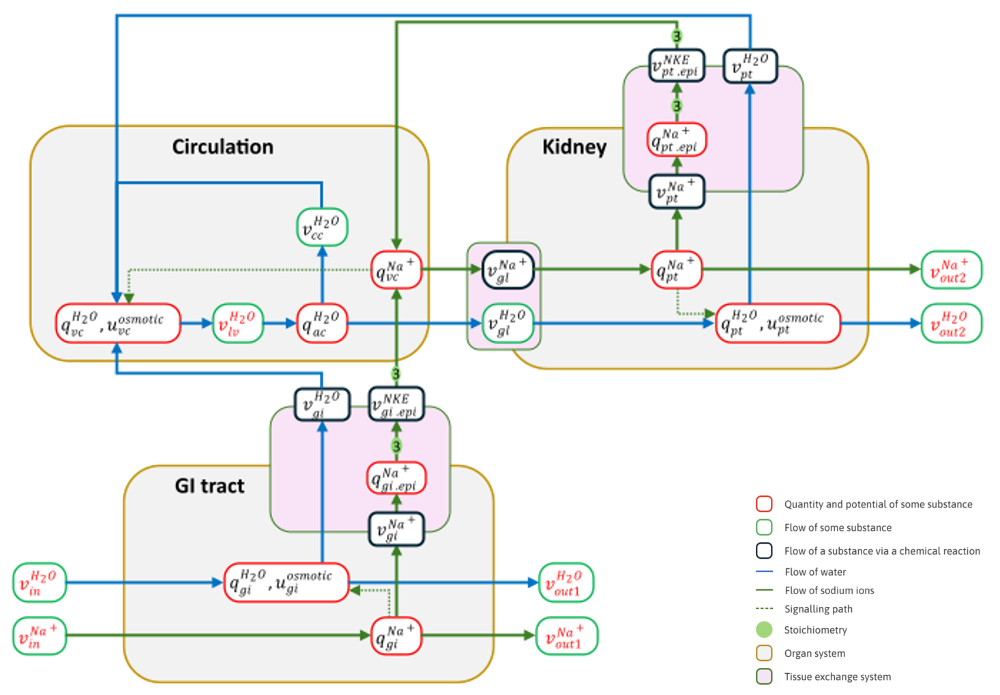

Blood volume control model
==========================

A simple model of the control of blood volume by sodium, as shown in the diagram below. This is primarily used as the source for producing an FC map dataset for the SPARC Portal. The *map* folder contains the actual source for the flatmap associated with this FC map. The *create_omex_files.py* script can be used to create the COMBINE archives for each of the simulation experiments associated with this FC map.

   The figure depicts the components of the model.

